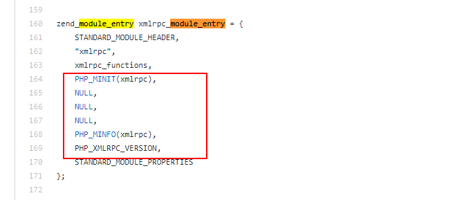
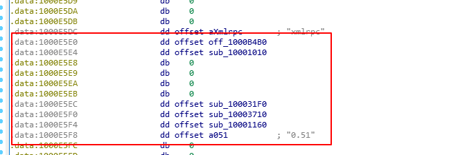
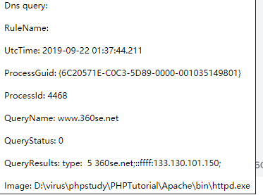

# phpstudy漏洞应急与检测


## 0x00: 序:

phpStudy后门被公开后,  第一时间通过IOC提取了最近一年存在此特征的终端数据, 数十台的用户确认感染. 对于数千人的公司, 近数万台终端的企业来说, 这个数据我认为是不能够反映真实的情况. 于是对漏洞进行的简单的分析和测试, 下面写一些自己的结论.

## 0x01: 后门说明

- **phpstudy 版本**
  - phpstudy 2016
  - phpstudy 2018
- **后门位置**
  - php_xmlrpc.dll
- **IOC**
  - [bbs|www|up|down|cms|file|ftp]360se.net

## 0x02: 应急响应

关于响应这里不具体说了, 简单说一下流程:

- [高危]安全预警
- 域名IOC特征匹配
- 通知修复
- 通过流量方式添加域名IOC规则告警
- **后门复现与分析**
- **完善检测方式/全面检测**

## 0x03: 漏洞分析与复现

#### 漏洞分析

关于漏洞的分析可以参考 安恒信息应急响应中心的报告: https://mp.weixin.qq.com/s/3XuxeU42C5qRqXFYUBCmpQ

总结如下:

1. PHP扩展定义函数zend_module_entry, 定义扩展名称 /版本/函数列表/以及执行四个阶段的初始化函数(可以为NULL).

2. xmlrpc源码中的四个初始化函数被劫持

3. xmlrpc后门触发条件: 

   php源代码中xmlrpc扩展定义: HTTP Header中存在"accept-Encoding: compress,gzip"

   

   xmlrpc.dll中xmlrpc_module_entry的定义:

   

   劫持的函数为: "sub_100031F0" 和 "sub_10003710", 实际中 "sub_10003710"并未定义任何内容.

   

​	

#### 漏洞复现:

构造HTTP包,  可以看到触发后门的IOC特征.

```bash
curl "http://192.168.8.30" \
-H "user-agent: Mozilla/5.0 (Windows NT 10.0; Win64; x64) AppleWebKit/537.36 (KHTML, like Gecko) Chrome/76.0.3809.132 Safari/537.36" \
-H "accept: text/html" \
-H "accept-Encoding: compress,gzip" \
-H "accept-language: en-US;q=0.9"
```


**SYSMON触发的DNS Query:**



## 0x04完善检测方式/全面检测

通过对漏洞进行分析和复测, 我们可以看到此后门是非常隐蔽的, 而且不会主动对外链接. 

所以, 通过网络IOC的检测方式的出来的数据是确认触发过后门的, 必然存在更多的用户还处于"隐身"的状态.  为了揪出这些潜在的后门, 可以通过主动扫描的方式进行触发式检测.

- DNS拦截C2的域名地址
- 扫描器添加自定义扫描规则
- 等着鱼儿上钩

## 0x05 杂谈

- 我们的人民警察还是很牛逼的, 为他们点赞
- 针对定制性的后门, 任何安全软件都显得无力
- 黑产的攻击方式远比防护来的更快


**参考:**

https://www.anquanke.com/post/id/187208

https://mp.weixin.qq.com/s/3XuxeU42C5qRqXFYUBCmpQ